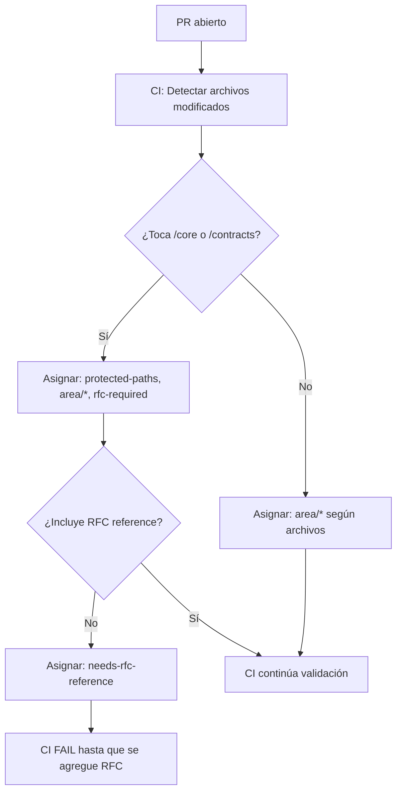

# Labels Standard — Etiquetas del Repositorio

**Versión:** 1.0  
**Fecha:** 2026-01-21  
**Estado:** Activo

---

## Propósito

Estandarizar las **etiquetas (labels)** del repositorio Tenon para enforcement, tracking y trazabilidad de cambios críticos.

---

## Labels Obligatorias

Estas labels deben existir en el repositorio y usarse según las políticas de gobernanza:

### 1. RFC & Governance

| Label | Color | Descripción | Uso |
|-------|-------|-------------|-----|
| `rfc-required` | `#d73a4a` (rojo) | Cambio requiere referencia RFC | Automático: CI lo asigna si PR toca `/core` o `/contracts` |
| `amendment` | `#b60205` (rojo oscuro) | Enmienda al RFC-00 (RFC-00A_*) | Manual: PR que modifica RFC-00 constitucional |
| `protected-paths` | `#e99695` (rosa) | Toca rutas protegidas (`/core`, `/contracts`) | Automático: CI lo detecta |
| `contracts-change` | `#f9d0c4` (naranja claro) | Modifica `/contracts/**` | Automático: CI lo detecta |

### 2. Enforcement & Exceptions

| Label | Color | Descripción | Uso |
|-------|-------|-------------|-----|
| `nogoals-exception` | `#fbca04` (amarillo) | Excepción autorizada a NoGoals tripwire | Manual: requiere justificación RFC + 2 aprobaciones |
| `emergency-fix` | `#d93f0b` (rojo urgente) | Fix de emergencia que bypasea protocolo | Manual: solo admins, requiere follow-up PR |
| `bypass-approved` | `#c2e0c6` (verde claro) | Bypass autorizado por CODEOWNERS | Manual: documentar en DECISIONS.md |

### 3. Review Status

| Label | Color | Descripción | Uso |
|-------|-------|-------------|-----|
| `needs-rfc-reference` | `#d73a4a` (rojo) | Falta referencia a RFC obligatoria | Automático: CI lo asigna si falta |
| `needs-codeowners-approval` | `#fbca04` (amarillo) | Esperando aprobación de CODEOWNERS | Automático: GitHub rules |
| `invariants-verified` | `#0e8a16` (verde) | Invariantes revisados y aprobados | Manual: reviewer marca después de checklist |

### 4. Type of Change

| Label | Color | Descripción | Uso |
|-------|-------|-------------|-----|
| `breaking-change` | `#d73a4a` (rojo) | Cambio incompatible (MAJOR version) | Manual: cambios a `/contracts` que rompen compatibilidad |
| `enhancement` | `#a2eeef` (azul claro) | Nueva funcionalidad (MINOR) | Manual |
| `bugfix` | `#d876e3` (morado) | Corrección de bug (PATCH) | Manual |
| `documentation` | `#0075ca` (azul) | Solo documentación | Manual |
| `refactor` | `#c5def5` (azul pálido) | Refactor sin cambio de comportamiento | Manual |

### 5. Area

| Label | Color | Descripción | Uso |
|-------|-------|-------------|-----|
| `area/core` | `#1d76db` (azul) | Cambios en `/core/**` | Automático/Manual |
| `area/contracts` | `#0052cc` (azul oscuro) | Cambios en `/contracts/**` | Automático/Manual |
| `area/adapters` | `#5319e7` (púrpura) | Cambios en `/adapters/**` | Automático/Manual |
| `area/governance` | `#bfd4f2` (azul claro) | Cambios en `/docs/governance/**` | Automático/Manual |
| `area/ci` | `#bfdadc` (gris azulado) | Cambios en workflows/scripts CI | Automático/Manual |

---

## Auto-Labeling (CI)

**Workflow:** `.github/workflows/auto-label.yml` (se crea en ITERACIÓN 4)

**Reglas:**
```yaml
# Si PR toca /core/**
→ agregar: protected-paths, area/core, rfc-required

# Si PR toca /contracts/**
→ agregar: protected-paths, area/contracts, contracts-change, rfc-required

# Si PR modifica docs/rfcs/RFC-00_MANIFEST.md
→ agregar: amendment

# Si PR no incluye referencia RFC en body/commits Y toca rutas protegidas
→ agregar: needs-rfc-reference
```

---

## Uso en Enforcement

### Protected Paths Policy

**CI valida:**
- Si PR tiene label `protected-paths` → requiere RFC reference + checklist
- Si PR tiene label `amendment` → requiere RFC-00A_*.md válido

**Excepción:**
- Si PR tiene label `bypass-approved` → permitir merge (documentar)

### NoGoals Enforcement

**CI valida:**
- Si detecta señales de NoGoals → FAIL
- **Excepción:** si PR tiene label `nogoals-exception` → requiere justificación + 2 aprobaciones

### Contracts Versioning

**CI valida:**
- Si PR tiene label `contracts-change` + `breaking-change` → requiere MAJOR version bump
- Si PR tiene label `contracts-change` (sin breaking) → requiere MINOR/PATCH version bump

---

## Workflow de Labels



---

## Cómo Crear Labels en GitHub

### Opción 1: Manual

1. **Ir a:** `Issues → Labels`
2. **New label** para cada entrada de la tabla
3. Copiar nombre, color y descripción exactos

### Opción 2: Script (Recomendado)

**Script:** `scripts/rfc00/setup_labels.py` (se crea en ITERACIÓN 3)

**Uso:**
```bash
python scripts/rfc00/setup_labels.py --repo Tenon
```

**Output:**
```
✅ Created label: rfc-required (#d73a4a)
✅ Created label: amendment (#b60205)
✅ Created label: protected-paths (#e99695)
...
✅ All labels created successfully
```

---

## Labels para Issues

Además de PRs, usar labels para issues:

| Label | Uso |
|-------|-----|
| `rfc-request` | Issue solicita cambio que requiere RFC |
| `governance` | Issue sobre políticas/enforcement |
| `question` | Pregunta sobre arquitectura/invariantes |
| `duplicate` | Issue duplicado (cerrar) |
| `wontfix` | No se implementará (explicar por qué) |

---

## Última Actualización

**2026-01-21:** Estándar inicial de labels publicado con RFC-00.
