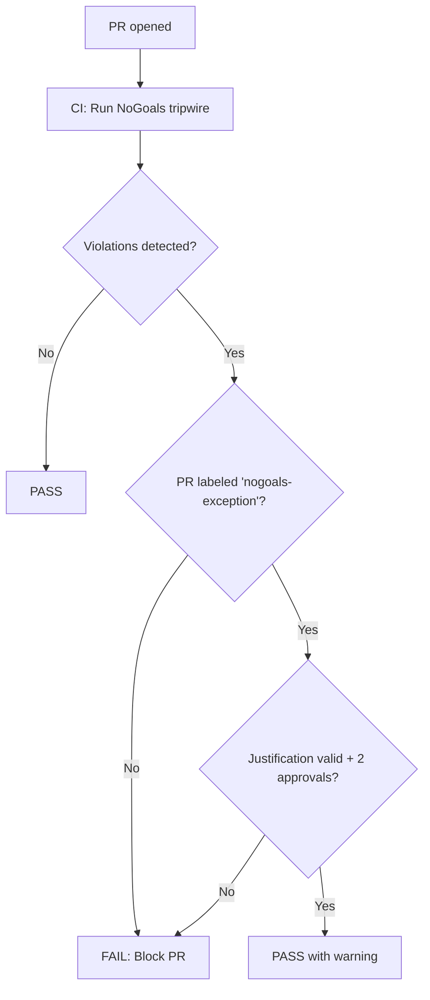

# NoGoals Enforcement — Bloqueo de Funcionalidad Prohibida

**Versión:** 1.0  
**Fecha:** 2026-01-21  
**Estado:** Activo

---

## Propósito

Implementar controles automáticos (CI "tripwires") y revisión manual para **prevenir que Tenon se convierta en un sistema de ejecución, pagos, o contabilidad oficial**, en violación de los No-Goals del RFC-00.

---

## No-Goals del RFC-00 (recordatorio)

Tenon **NO** es, ni será:
- Un sistema de pagos / ejecución de transferencias / orquestación de movimientos de dinero
- Un libro contable oficial, ERP, GL, subledger oficial, ni reemplazo de contabilidad
- Un sistema que "corrige" contabilidad por su cuenta
- Un motor de pricing, facturación o cálculo fiscal como fuente oficial
- Una plataforma que dependa de "magia IA" para afirmar verdad sin evidencia
- Un data warehouse genérico ni un ETL generalista como producto

---

## Enforcement Automático: Tripwires

### 1. Keyword Detection (Archivos y Código)

**CI ejecuta validador que busca señales prohibidas en:**
- Nombres de archivos/carpetas
- Nombres de clases/funciones
- Imports de librerías
- Strings en código (comentarios/docs permitidos si están marcados)

### Señales de Alerta (Keywords)

#### 🚨 ALTA PRIORIDAD (bloqueo automático)

**En `/core/**` solamente:**

| Keyword/Pattern | Razón |
|-----------------|-------|
| `ExecutePayment`, `ProcessTransfer`, `PostTransaction` | Sugiere ejecución de movimientos de dinero |
| `CreateLedgerEntry`, `BookToGL`, `PostToAccounting` | Sugiere escritura en libro contable oficial |
| `AutoCorrect`, `FixDiscrepancy`, `ApplyCorrection` | Sugiere modificación automática de contabilidad |
| `CalculateTax`, `ComputeFee`, `DeterminePricing` | Sugiere cálculo fiscal/pricing como fuente oficial |
| `StripeClient`, `PayPalAPI`, `AdyenSDK` (imports) | Sugiere integración de ejecución de pagos en core |

**Excepciones:**
- Permitido en `/adapters/**` (adapters observan, no ejecutan)
- Permitido en `/docs/**` y comentarios/strings si están claramente marcados como "example of what NOT to do"

#### ⚠️ MEDIA PRIORIDAD (warning + revisión manual)

| Keyword/Pattern | Razón |
|-----------------|-------|
| `Reconcile` (verbo, no sustantivo) | Puede sugerir "corregir" en lugar de "detectar discrepancia" |
| `Transfer`, `Payment` (como verbos) | Puede sugerir acción en lugar de observación |
| `Official`, `Authoritative`, `SourceOfTruth` | Puede sugerir que Tenon reemplaza sistemas oficiales |

**Excepción:** Si está en contexto de "detected transfer" o "observed payment", es válido.

### 2. Path/Structure Detection

**CI valida que NO existan rutas como:**

```
/core/payment_execution/
/core/accounting_posting/
/core/transfer_orchestration/
/core/tax_calculation/
```

**Permitido:**
```
/core/discrepancy_detection/
/core/correlation/
/core/evidence/
/adapters/stripe_observer/  # observar, no ejecutar
```

### 3. Dependency Detection

**CI valida que `/core` NO importe:**
- SDKs de payment processors (Stripe, PayPal, Adyen) como clientes de ejecución
- SDKs de ERP/contabilidad como clientes de escritura

**Permitido:**
- Librerías de parsing/observación (ej: leer webhooks de Stripe)
- Librerías de validación/schemas

---

## Enforcement Manual: Revisión Institucional

Aunque pasen tripwires automáticos, **requieren aprobación institucional extra** si el PR:

1. **Introduce lógica de decisión automática:**
   - "Si discrepancia < $X, auto-resolver"
   - "Si falta dato, auto-completar con valor default"
   - "Si conflicto, aplicar regla de precedencia automática"

   **Por qué es peligroso:** viola invariante de "fallos explícitos" — sistema debe producir estado "insuficiente", no asumir.

2. **Agrega campos de "acción sugerida":**
   - `suggested_correction`, `recommended_posting`, `auto_fix_applied`

   **Línea delgada:** está permitido producir "sugerencia documentada" si queda claro que es:
   - Solo observacional
   - No se ejecuta automáticamente
   - Requiere aprobación humana externa

   **Requiere justificación RFC explícita.**

3. **Introduce conceptos de "estado mutable":**
   - "Actualizar discrepancia resuelta" (en lugar de "agregar evento de resolución")
   - "Borrar evento duplicado" (en lugar de "marcar como duplicado")

   **Por qué es peligroso:** viola append-only.

---

## Proceso de Excepción Autorizada

Si un PR **legítimamente** necesita introducir funcionalidad que dispara tripwires (ej: agregar campo `suggested_ledger_entry` para uso de auditoría humana):

### Requisitos:

1. **PR debe estar etiquetado:** `nogoals-exception`
2. **Debe incluir justificación RFC:**
   - Por qué es necesario
   - Por qué NO viola los no-goals (ej: es solo sugerencia, no ejecución)
   - Cómo se previene abuso (ej: campo es read-only, no trigger automático)
3. **Aprobación de 2+ CODEOWNERS institucionales**
4. **Registro en `docs/governance/DECISIONS.md`:**

```markdown
### NoGoals Exception: PR #456

- **Fecha:** 2026-01-21
- **Cambio:** Agregar campo `suggested_correction` a Discrepancy
- **Justificación:** Auditoría humana requiere ver sugerencias; NO se ejecuta automáticamente
- **Controles:** Campo read-only, solo poblado en reportes, no en core execution path
- **Aprobado por:** @architect1, @architect2
```

---

## Tripwire Script

**Script:** `scripts/rfc00/validate_nogoals`

**Ejecución:**
```bash
python scripts/rfc00/validate_nogoals.py --pr-diff HEAD~1..HEAD
```

**Salida:**
```
✅ No NoGoals violations detected
```

```
❌ FAIL: NoGoals violation detected

File: core/payment_executor.py
Line 23: def execute_payment(amount, recipient):
Reason: Keyword "execute_payment" suggests payment execution (prohibited in /core)

Recommendation: Remove execution logic from /core or move to adapter observation.
If this is a false positive, add PR label 'nogoals-exception' and justify in PR description.
```

---

## Workflow de Validación



---

## Falsos Positivos Comunes

### ✅ Permitidos (no son violaciones)

```python
# Observar un payment (adapter)
def parse_stripe_payment_event(webhook_data):
    return CanonicalPayment(...)

# Detectar discrepancia en payment
def detect_payment_discrepancy(observed, expected):
    if observed.amount != expected.amount:
        return Discrepancy(...)

# Documentar un transfer observado
class ObservedTransfer:
    def __init__(self, source, destination, amount):
        self.source = source  # OK: observación, no ejecución
```

### ❌ Violaciones Reales

```python
# Ejecutar un payment (PROHIBIDO en /core)
def execute_stripe_payment(amount, card_token):
    stripe.Charge.create(amount=amount, source=card_token)  # ❌ ejecución

# Postear a ledger oficial (PROHIBIDO)
def post_to_general_ledger(entry):
    erp_client.create_ledger_entry(entry)  # ❌ contabilidad oficial

# Auto-corregir contabilidad (PROHIBIDO)
def auto_fix_discrepancy(discrepancy):
    if discrepancy.amount < 100:
        post_correction(discrepancy)  # ❌ auto-corrección
```

---

## Educación y Mensajes de Error

Cuando tripwire detecta violación, mensaje debe ser educativo:

```
❌ NoGoals Violation Detected

Tenon is designed to OBSERVE and CORRELATE financial events, not EXECUTE them.

You are attempting to introduce payment execution logic in /core.
This violates RFC-00 No-Goals.

What to do:
1. If this is observation logic: rename function/variable to clarify (e.g., "observed_payment" instead of "execute_payment")
2. If this is adapter code: move to /adapters (adapters observe external systems)
3. If this truly requires execution: this requires an RFC-00A_* amendment to relax No-Goals
   (extremely rare; consult architects first)

For questions, see: docs/governance/NoGoals_Enforcement.md
```

---

## Última Actualización

**2026-01-21:** Política inicial de NoGoals enforcement publicada con RFC-00.
