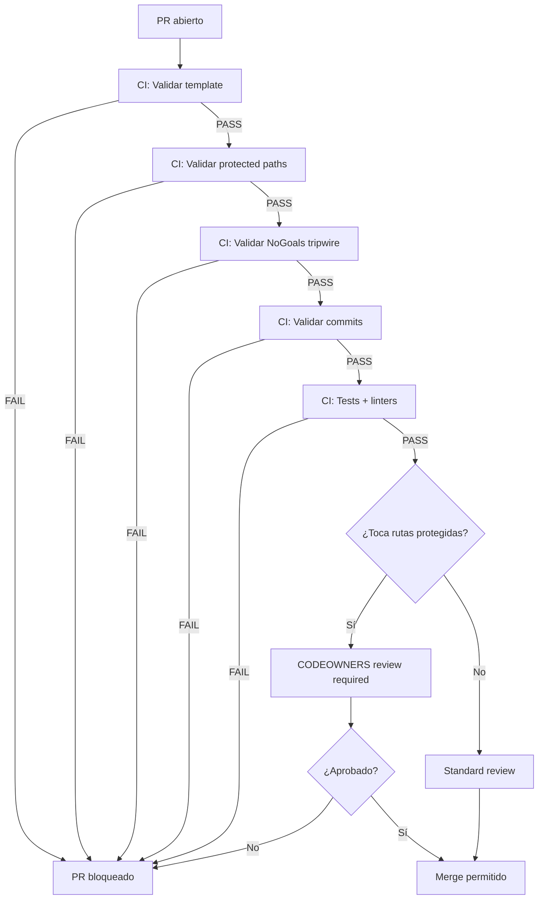

# PR Gate RFC-00 — Condiciones PASS/FAIL para Pull Requests

**Versión:** 1.0  
**Fecha:** 2026-01-21  
**Estado:** Activo

---

## Propósito

Definir condiciones **exactas y ejecutables** para aprobar o rechazar PRs en el repositorio Tenon, alineadas a los invariantes y threat model del RFC-00.

Este documento es el **checklist canónico** que CI ejecuta y que reviewers humanos verifican.

---

## Condiciones PASS (Todas deben cumplirse)

### 1. PR Template Completado

**Verificación:** CI valida que el PR incluya todos los campos obligatorios del template:

- ✅ **Descripción del cambio:** qué hace el PR
- ✅ **Referencia a RFC:** qué RFC autoriza/define este cambio (o "N/A — non-core change" si aplica)
- ✅ **Rutas tocadas:** lista de archivos/carpetas modificados
- ✅ **Impacto en invariantes:** declaración explícita de qué invariantes toca (o "None")
- ✅ **Checklist de invariantes:** items aplicables marcados

**FAIL si:** template no está presente o campos obligatorios están vacíos.

**Script:** `scripts/rfc00/validate_pr_template`

---

### 2. Rutas Protegidas — Protocolo Cumplido

**Verificación:** Si el PR modifica `/core/**`, `/contracts/**`, o `docs/rfcs/RFC-00_MANIFEST.md`:

- ✅ **Referencia a RFC válida:** debe citar RFC específico (o RFC-00A_* si es enmienda)
- ✅ **Sección "Impact on Invariants" completa:** describir qué invariantes se tocan y por qué se respetan
- ✅ **Aprobación de CODEOWNERS:** al menos 1 aprobación de owner designado

**FAIL si:**
- PR toca rutas protegidas sin referencia RFC
- Sección de impacto falta o está vacía
- No hay aprobación de CODEOWNERS

**Policy:** [`Protected_Paths_Policy.md`](Protected_Paths_Policy.md)  
**Script:** `scripts/rfc00/validate_protected_paths`

---

### 3. RFC-00 Inmutabilidad

**Verificación:** Si el PR modifica `docs/rfcs/RFC-00_MANIFEST.md`:

- ✅ PR está etiquetado con `amendment`
- ✅ PR incluye un RFC-00A_*.md válido que justifica el cambio

**FAIL si:**
- PR modifica RFC-00 sin etiqueta `amendment`
- No existe RFC-00A_*.md correspondiente

**Policy:** [`RFC_Amendment_Policy.md`](RFC_Amendment_Policy.md)  
**Script:** `scripts/rfc00/validate_rfc_amendments`

---

### 4. No-Goals Tripwire

**Verificación:** CI busca señales de funcionalidad prohibida por RFC-00 No-Goals:

**Señales de alerta (keywords/paths):**
- Archivos/rutas que contengan: `payment`, `transfer`, `posting`, `accounting_entry`, `execute_payment`
- Imports de librerías de pagos: `stripe`, `paypal`, `adyen` (en `/core` — permitidos en `/adapters`)
- Funciones/clases que sugieran ejecución: `ExecuteTransaction`, `PostToLedger`, `ProcessPayment`

**FAIL si:**
- Se detectan señales de No-Goals en rutas de core
- PR no incluye justificación explícita y aprobación institucional para introducir funcionalidad de ejecución

**Excepción:** Si el PR está etiquetado `nogoals-exception` Y referencia un RFC-00A_* que relaja un no-goal, se permite.

**Policy:** [`NoGoals_Enforcement.md`](NoGoals_Enforcement.md)  
**Script:** `scripts/rfc00/validate_nogoals`

---

### 5. Tests y CI Checks

**Verificación:**

- ✅ Todos los tests unitarios pasan
- ✅ Todos los tests de propiedades pasan (si existen)
- ✅ Linters/formatters pasan
- ✅ Status checks obligatorios (definidos en [`CI_Status_Checks.md`](CI_Status_Checks.md)) están en green

**FAIL si:** algún check obligatorio falla.

---

### 6. Commit Messages

**Verificación:** CI valida que commits sigan [`Commit_Policy.md`](Commit_Policy.md):

- ✅ Formato: `type(scope): message`
- ✅ Si toca rutas protegidas, commit debe incluir `[RFC-XX]` en el mensaje

**FAIL si:** commits no siguen convención o faltan referencias RFC obligatorias.

**Script:** `scripts/rfc00/validate_commit_messages`

---

## Condiciones FAIL (cualquiera tumba el PR)

| Condición | Razón |
|-----------|-------|
| Template vacío/incompleto | Falta trazabilidad de decisión |
| Cambio a `/core` o `/contracts` sin RFC | Violación de Protected Paths Policy |
| Cambio a RFC-00 sin enmienda formal | Violación de inmutabilidad constitucional |
| Señales de No-Goals sin excepción | Violación de invariantes y promesa del sistema |
| CODEOWNERS no aprobó | Cambio crítico sin review institucional |
| Tests fallan | Posible regresión de invariantes |
| Commit messages no conformes | Falta trazabilidad de cambios |

---

## Excepciones Autorizadas

**Única excepción permitida:** PR etiquetado con `emergency-fix` por owner institucional.

**Requisitos:**
- Debe estar aprobado por 2+ CODEOWNERS
- Debe incluir justificación de emergencia (security, producción caída, etc.)
- Debe abrir un "follow-up PR" dentro de 48h con protocolo completo

**CODEOWNERS puede overridear** bloqueos de CI bajo estas condiciones, pero debe quedar registrado en `docs/governance/DECISIONS.md`.

---

## Workflow de Validación

---

## Checklist para Reviewers Humanos

Además de lo que CI valida automáticamente, reviewers deben verificar:

- [ ] Cambio respeta determinismo (mismo input → mismo output)
- [ ] Cambio respeta append-only (no hay deletes/mutaciones destructivas)
- [ ] Cambio respeta separación core/adapters (core no tiene lógica de negocio externa)
- [ ] Explicabilidad: discrepancias/decisiones del sistema quedan loggeadas
- [ ] Idempotencia: reintentos no causan duplicación ni divergencia
- [ ] Fallos explícitos: no hay "asunciones silenciosas" de verdad

**Checklist completo:** [`Review_Checklist.md`](Review_Checklist.md)

---

## Última Actualización

**2026-01-21:** PR Gate inicial publicado con RFC-00.
