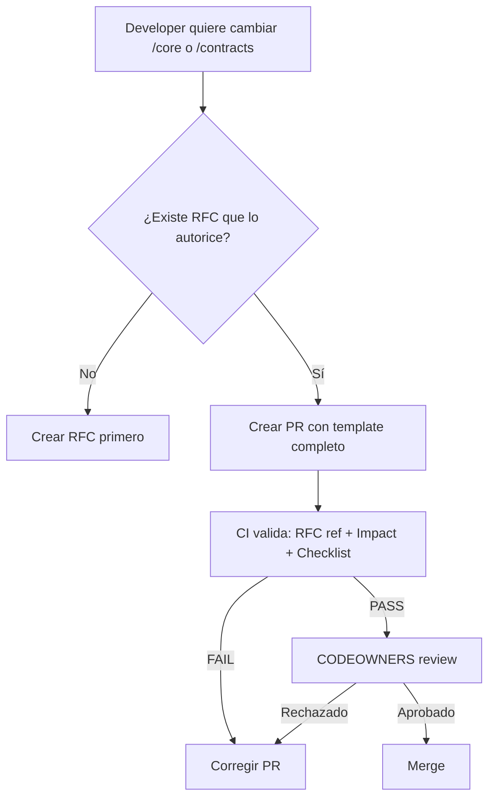

# Protected Paths Policy — Control de Cambios a Rutas Críticas

**Versión:** 1.0  
**Fecha:** 2026-01-21  
**Estado:** Activo

---

## Propósito

Proteger las rutas críticas del sistema Tenon que contienen invariantes, contratos institucionales y lógica de core que, si se modifican sin protocolo, **pueden invalidar la promesa de reproducibilidad, trazabilidad y determinismo**.

---

## Rutas Protegidas

Las siguientes rutas están **protegidas** y requieren protocolo de cambio:

### 1. `/core/**`

**Qué contiene:**
- Lógica de invariantes del sistema
- Motores de correlación, causalidad, discrepancia
- Normalización canónica
- Estado y evidencia append-only

**Por qué está protegida:**
- Cambios pueden romper determinismo
- Cambios pueden violar append-only o trazabilidad
- Cambios pueden contaminar el core con lógica de negocio externa (ERP-specific, PSP-specific)

### 2. `/contracts/**`

**Qué contiene:**
- Contratos canónicos (schemas, semántica)
- Definiciones de eventos, entidades, y relaciones
- Reglas de versionado y compatibilidad

**Por qué está protegida:**
- Cambios pueden invalidar reproducibilidad histórica
- Cambios pueden romper adapters existentes silenciosamente
- Cambios requieren versionado semántico y evidencia de compatibilidad

### 3. `docs/rfcs/RFC-00_MANIFEST.md`

**Qué contiene:**
- Documento constitucional del sistema

**Por qué está protegida:**
- Modificaciones solo permitidas vía RFC-00A_* (Amendment)
- Ver: [`RFC_Amendment_Policy.md`](RFC_Amendment_Policy.md)

---

## Condiciones Mínimas para Cambios

Un PR que modifique archivos en rutas protegidas **solo puede ser aprobado** si cumple **TODAS** las condiciones:

### ✅ Checklist Obligatorio

1. **Referencia explícita a RFC:**
   - PR debe citar el RFC que autoriza/define el cambio (o RFC-00A_* si es enmienda)
   - Ejemplo: "Implementa RFC-02 — Ingest Append-Only" o "Corrige bug en correlación (RFC-04 Section 3.2)"

2. **Impacto documentado:**
   - PR debe incluir sección "Impact on Invariants" describiendo:
     - Qué invariantes toca (append-only, determinismo, trazabilidad, etc.)
     - Por qué el cambio respeta esos invariantes (o requiere enmienda)

3. **Checklist de invariantes completado:**
   - Template de PR incluye checklist de invariantes
   - Todos los items aplicables deben estar marcados ✅

4. **Pruebas de regresión:**
   - Cambios a `/core` requieren tests que demuestren que invariantes siguen cumpliéndose
   - Cambios a `/contracts` requieren:
     - Tests de compatibilidad (si aplica)
     - Actualización de versionado semántico
     - Migración/adaptación documentada (si breaking change)

5. **Aprobación de CODEOWNERS:**
   - PR debe ser aprobado por owners designados en `.github/CODEOWNERS`

---

## Excepciones Permitidas

### Cambios "Safe" (no requieren protocolo completo):

- **Documentación interna** dentro de `/core` (comentarios, READMEs) que no afectan lógica
- **Tests adicionales** que no modifican implementación
- **Refactors "safe"** (rename, extract function) que:
  - No cambian comportamiento observable
  - Pasan todos los tests existentes
  - Están marcados explícitamente como "refactor only, zero behavior change"

**Aún así requieren:** aprobación de CODEOWNERS y PR template completo.

---

## Enforcement Automático

**CI ejecutará:**

### 1. Validador de Protected Paths (`scripts/rfc00/validate_protected_paths`)

- Detecta si el diff del PR toca rutas protegidas
- Si sí:
  - Verifica que PR template incluya:
    - Referencia a RFC
    - Sección "Impact on Invariants"
    - Checklist completado
  - **FAIL si falta cualquiera**

### 2. CODEOWNERS Enforcement

- GitHub requiere aprobación de owners definidos en `.github/CODEOWNERS`
- **FAIL si no hay aprobación**

### 3. CI Status Checks Obligatorios

- Ver: [`CI_Status_Checks.md`](CI_Status_Checks.md)
- Todos los checks de invariantes/tests deben pasar

---

## Señales de Alerta (Manual Review)

Aunque pasen las validaciones automáticas, **requieren revisión humana extra** si:

- Cambio agrega lógica condicional compleja en `/core` (puede romper determinismo)
- Cambio modifica formato de eventos canónicos en `/contracts` (puede romper reproducibilidad)
- Cambio introduce dependencias externas nuevas en `/core` (riesgo de contaminación)
- Cambio altera orden de procesamiento o agregación (puede romper determinismo)

---

## Workflow de Cambio a Rutas Protegidas



---

## Registro de Cambios a Rutas Protegidas

Mantener log en `docs/governance/DECISIONS.md`:

```markdown
### Protected Paths Changes

- **PR #123** (2026-XX-XX): [Descripción breve]
  - Ruta: /core/correlation_engine.py
  - RFC: RFC-04 Section 3.2
  - Invariantes: Determinismo, Trazabilidad
  - Aprobado por: @architect
```

---

## Última Actualización

**2026-01-21:** Política inicial de protected paths publicada con RFC-00.
